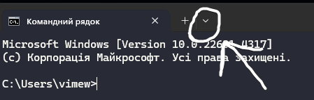
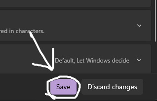

# Cyn FAKE virus

</img>
</img>

I made this thing just for my tiktok video (i was making it for 30 minutes xd)

### ***⚠️WARNING | THIS THING CAN EASILY LAG YOUR PC, USE AT OWN RISK!!⚠️***

## Simple Installation (Windows 10)
1. [Download Compiled code](https://github.com/noxygalaxy/cyn-fake-virus/releases/download/v1.0.0/cyn-fake-virus.exe)  
2. Open cmd.exe (type it in search or in Win+R menu)  
4. Launch Application and it should work! if it doesnt send issue into [Issues](https://github.com/noxygalaxy/cyn-FAKE-virus/issues)  
(After closing it gonna still have CMDs opened, thats completely fine!)

## Simple Installation (Windows 11)
1. [Download Compiled code](https://github.com/noxygalaxy/cyn-fake-virus/releases/download/v1.0.0/cyn-fake-virus.exe)  
2. Open cmd.exe (type it in search or in Win+R menu)  
3. Follow screenshots:  
  
  
  
  
  
4. Launch Application and it should work! if it doesnt send issue into [Issues](https://github.com/noxygalaxy/cyn-FAKE-virus/issues)  
(After closing it gonna still have CMDs opened, thats completely fine!)

## Installation
1. Install [Python 3.X](https://www.python.org/) if you haven't already.
2. Install source code and run `install.bat` ( it's gonna download required libraries! )
3. After console closed, run `start.bat` ( it's gonna start program!)  
   it should work! if it doesnt send issue into [Issues](https://github.com/noxygalaxy/cyn-FAKE-virus/issues)  
(After closing it gonna still have CMDs opened, thats completely fine!)

## I Found a bug!
You can send it into [Issues](https://github.com/noxygalaxy/cyn-FAKE-virus/issues) and i will try to reply quick as possible!

# GIMME A STAR IF YOU LIKE IT!!!
